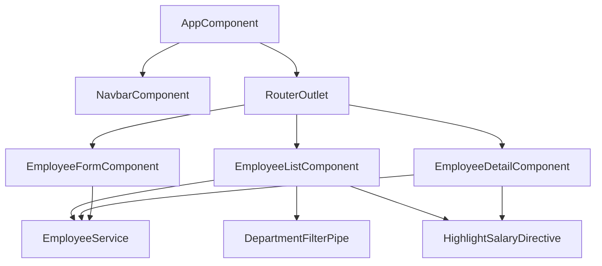

# Employee Management Dashboard

An interactive, real-time Employee Management web application built with Angular 17+ and TypeScript.

## Features
- **Employee Directory**: View a list of all employees in a Data Table with sort, pagination, and filtering.
- **Employee Details**: View deep details about an individual employee.
- **Add/Edit Employee**: Manage employee records using robust Angular Reactive Forms.
- **Material Design**: Uses Angular Material components and theming for a professional responsive UI.
- **Mock Service**: Emulates a real backend API using RxJS Observables and delays.
- **Custom Pipes & Directives**: Features a custom Department filter pipe and a salary highlighting directive.

## Setup Instructions

1. **Prerequisites**: Ensure you have Node.js and Angular CLI (`npm i -g @angular/cli`) installed.
2. **Install Dependencies**: Run `npm install` in the project root.
3. **Run Development Server**: Run `npm start` or `ng serve`. Navigate to `http://localhost:4200/`. The application will automatically reload if you change any of the source files.

## Architecture Overview

